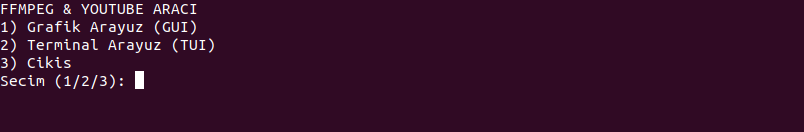
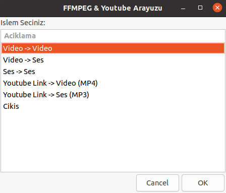
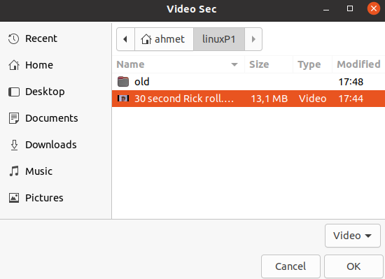
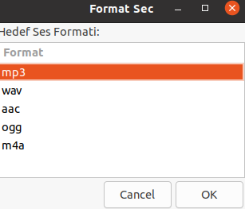
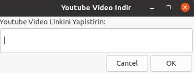
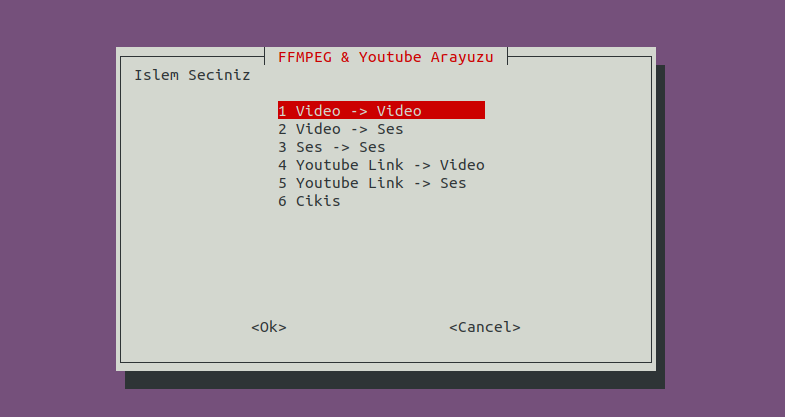
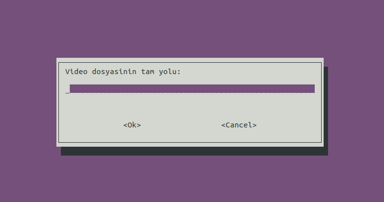
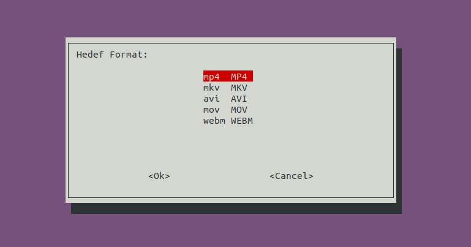
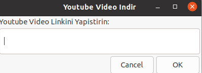

# Linux Araçları ve Kabuk Programlama Ödevi 

Bu proje, Linux komut satırında kullanılan ffmpeg ve ekstra olarak yt-dlp araçları için geliştirilmiş bir arayüz uygulamasıdır. Kullanıcılar bu script sayesinde karmaşık terminal komutları yazmadan video dönüştürme, ses dönüştürme ve Youtube üzerinden indirme işlemlerini gerçekleştirebilir.

Uygulama, PARDUS işletim sistemi üzerinde çalışabilecek şekilde tasarlanmıştır ve hem Grafik Arayüz (GUI) hem de Terminal Arayüzü (TUI) seçenekleri sunar.

# Proje Tanıtım Videosu 📹

Projenin kurulumu, kullanımı ve özelliklerini anlatan tanıtım videosuna aşağıdaki bağlantıdan ulaşabilirsiniz:

[linkKoyucam]

# Kurulum ve Sistem Gereksinimleri ⚙️

Projenin çalışabilmesi için sistemde aşağıdaki paketlerin yüklü olması gerekir:

ffmpeg
yad
whiptail
yt-dlp

Script çalıştırıldığında bu paketleri kontrol eder ve eksik varsa otomatik olarak kurar. Manuel kurulum yapmak isterseniz şu komutu kullanabilirsiniz:

sudo apt update
sudo apt install ffmpeg yad whiptail yt-dlp

Projeyi çalıştırmak için terminali açın ve şu komutları uygulayın:

chmod +x script.sh
./script.sh

# Kullanım Kılavuzu ve Ekran Görüntüleri 🖼️

Script çalıştırıldığında kullanıcıya arayüz tercihi sorulur. 1 tuşu grafik arayüzü, 2 tuşu terminal arayüzünü açar.

## 1. Grafiksel Kullanıcı Arayüzü (GUI - YAD) 🖥️

YAD kullanılarak hazırlanan bu arayüz fare ile kontrol edilir.

Ana Menü:
Kullanıcının işlem seçtiği ekrandır.

Dosya ve Format Seçimi:
Dönüştürme işleminde dosya seçimi ve hedef formatın belirlendiği ekranlar.

Youtube İndirme:
Youtube linkinin girildiği ekran.

İşlem Durumu:
İşlem yapılırken çıkan ilerleme çubuğu.

## 2. Terminal Tabanlı Kullanıcı Arayüzü (TUI - Whiptail) ⌨️

Whiptail kullanılarak hazırlanan bu arayüz klavye ile kontrol edilir.

Ana Menü:
Ok tuşları ile işlem seçilen ekran.

Video ve Ses Dönüştürme:
Dosya yolunun girildiği ve formatın seçildiği ekranlar.

Youtube İndirme:
Linkin yapıştırıldığı ekran.

İşlem Durumu:
Terminal üzerinde dolan ilerleme çubuğu.

# Teknik Detaylar 🛠️

Proje Bash script dili ile yazılmıştır.

check_dependencies fonksiyonu eksik paketleri kontrol eder.
generate_output_name fonksiyonu çıktı dosyası ismini ayarlar.
convert_media fonksiyonu ffmpeg işlemlerini yönetir.
download_media fonksiyonu yt-dlp işlemlerini yönetir.
run_gui ve run_tui fonksiyonları menü döngülerini sağlar.
